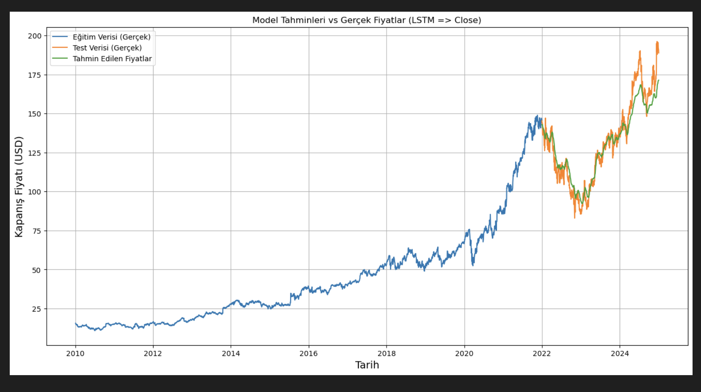
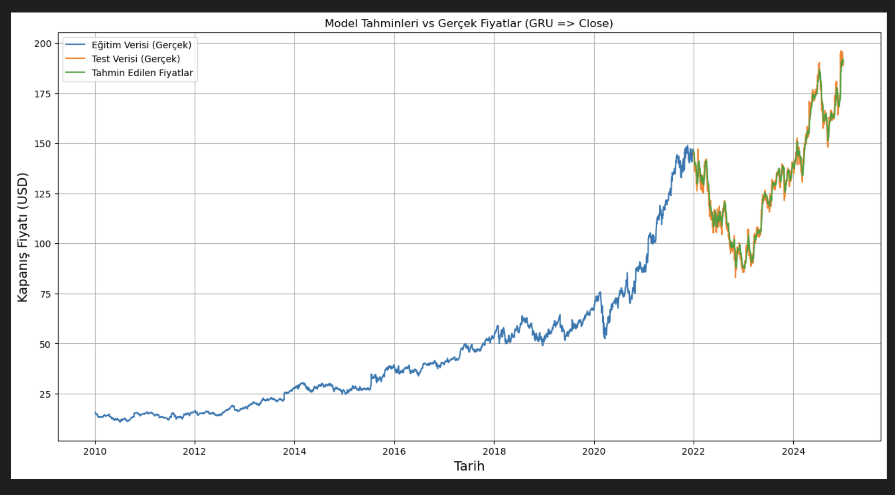
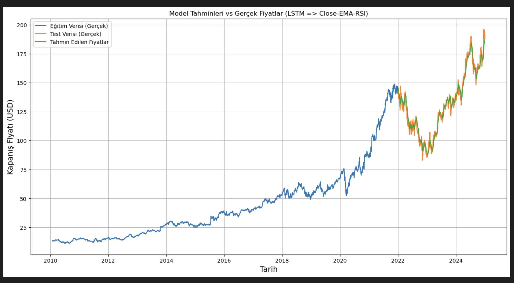
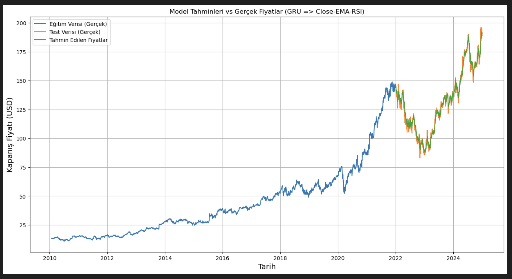

# 📈 Stock Price Prediction (GRU & LSTM - PyTorch)

This project was developed during my internship at **Microsoft** and focuses on predicting stock prices using deep learning techniques. The model leverages **GRU (Gated Recurrent Unit)** and **LSTM (Long Short-Term Memory)** architectures to capture temporal dependencies in financial time-series data.

---

## 🚀 Project Overview

The goal of this project is to build a robust stock price forecasting system using historical market data. By applying advanced deep learning models, the project aims to:

- Capture sequential patterns in stock price movements  
- Compare performance of GRU and LSTM models  
- Enhance predictions using technical indicators (EMA, RSI)  
- Evaluate model performance using RMSE  

---

## 🧠 Models Used

- **LSTM (Long Short-Term Memory)**
- **GRU (Gated Recurrent Unit)**

Both models are implemented using **PyTorch** and trained on time-series stock data.

---

## ⚙️ Features & Techniques

- Time-series data preprocessing  
- Feature engineering (EMA, RSI indicators)  
- Sliding window sequence generation  
- Model training & evaluation  
- Performance comparison between models  
- Visualization of predictions vs actual prices  

---

## 📊 Results & Visualizations

---

### 🔹 LSTM – Close Price Prediction

--- RMSE: **8.08**

### 🔹 GRU – Close Price Prediction

--- RMSE: **3.97**

### 🔹 LSTM – Close + EMA + RSI

- RMSE: **4.54**

---

### 🔹 GRU – Close + EMA + RSI

- RMSE: **3.62**

---

## 📈 Key Insights

- GRU performed slightly better than LSTM in terms of RMSE  
- Adding technical indicators (EMA & RSI) improved model accuracy  
- Models successfully captured overall market trends  
- Predictions closely follow real price movements  

---

## 🛠️ Technologies Used

- Python  
- PyTorch  
- NumPy  
- Pandas  
- Matplotlib  

---

## 💼 Experience (Microsoft Internship)

This project was developed as part of my internship experience at **Microsoft**, where I focused on:

- Applying deep learning models to real-world financial data  
- Building end-to-end machine learning pipelines  
- Experimenting with different architectures and features  
- Evaluating model performance using industry-standard metrics  

---

## 📌 Future Improvements

- Hyperparameter tuning  
- Transformer-based models  
- Real-time prediction system  
- Deployment as a web application  

---

## 📬 Contact

Feel free to connect or reach out for collaboration!
